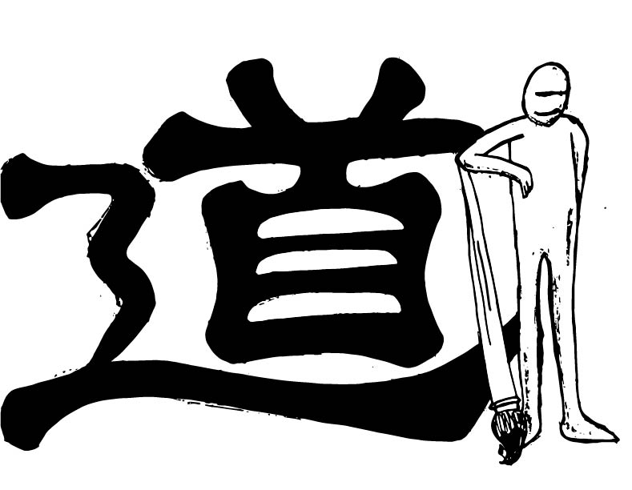

# Ebb-Flow
## A Dao of Web Design Summary 
The article “A Dao of Web Design” by John Allsopp lays out for the reader, a guide to what it means to be a web designer; specifically, a good one. He compares the art of web design to the ideas of Daoism, and how we must roll with the “ebb and flow” of an ever changing world and industry of technology. The web came from and developed off the invention of print. However, it is now time for the new technology to branch off from the old and become its own revolutionary self. We as designers must help make that happen. Function must come over fashion, and it must come in many different layers. From Fonts, to the layout of a page and even the colors on a screen, everything must adapt to the ever changing world of the web as well as adapting to the user. This can mean many things, from people’s physical impairments, such as bad vision, to technological shortcomings that cause older modes of communicating with the web to not work properly with new programs. This is the ultimate way to be sure you reach all users and accomplish the goal of communication with them regardless of where it is being seen.

